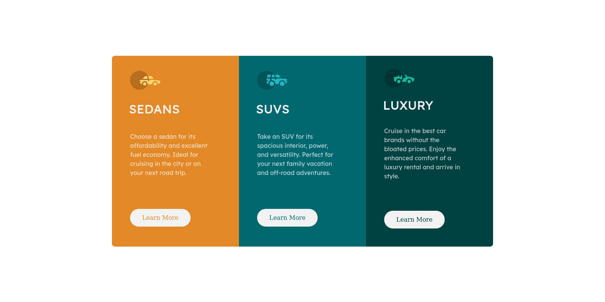

# Frontend Mentor - 3-column preview card component solution

This is a solution to the [3-column preview card component challenge on Frontend Mentor](https://www.frontendmentor.io/challenges/3column-preview-card-component-pH92eAR2-).

## Table of contents

- [Overview](#overview)

  - [The challenge](#the-challenge)

  - [Screenshot](#screenshot)

  - [Links](#links)

- [Built with](#built-with)

- [Project structure](#project-structure)

## Overview

### The challenge

Users should be able to:

- View the optimal layout depending on their device's screen size
- See hover states for interactive elements

### Screenshot



### Links

- [Solution](https://github.com/nerdy-guy/3-column-preview-card-component-main)

- [Live Site](https://nerdy-guy.github.io/3-column-preview-card-component-main/)

## Built with

- Semantic HTML5 markup
- CSS custom properties
- Flexbox
- CSS Grid
- Mobile-first workflow

## Project structure

```
3-column-preview-card-component-main
├── images
│   ├── favicon-32x32.png
│   ├── icon-luxury.svg
│   ├── icon-sedans.svg
│   └── icon-suvs.svg
├── index.html
├── README.md
├── screenshot.png
└── style.css
```
